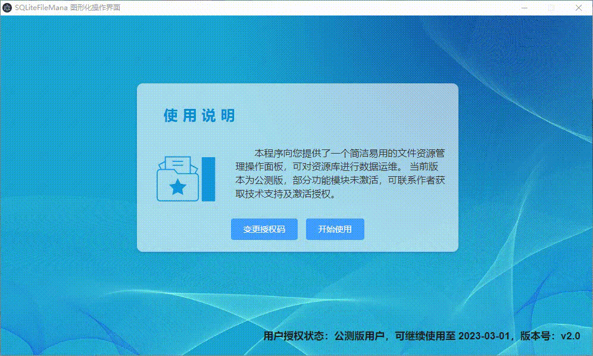
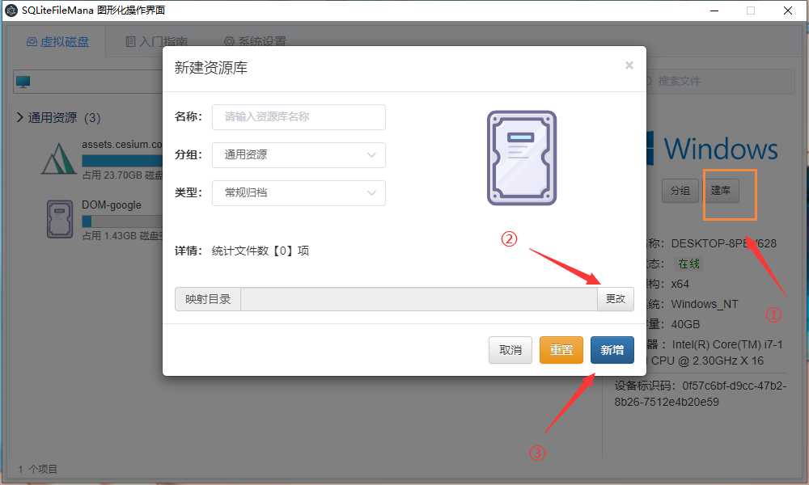
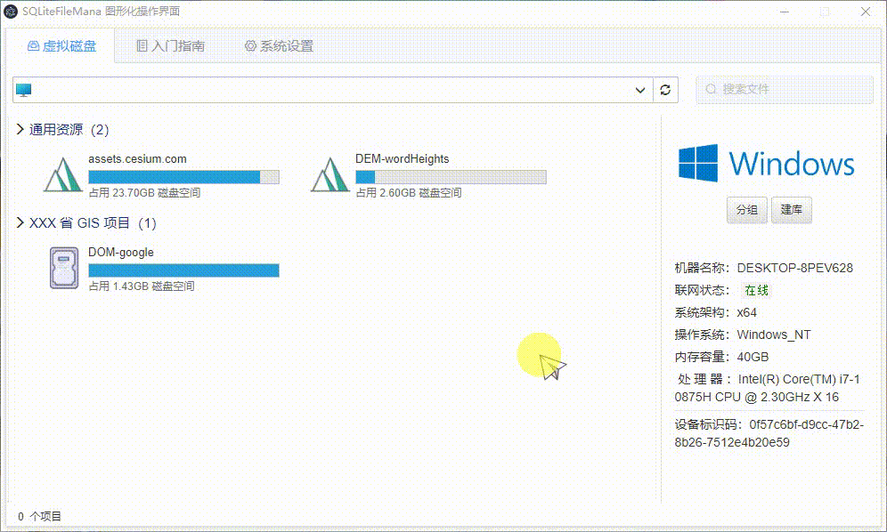

## 一、软件介绍

本软件是使用 Election 开发的一个用户操作面板界面，主要用于对 SQLiteFileMana 服务端的资源库进行管理。

开源库地址：https://gitee.com/WangShan010/SQLiteFileMana

## 二、我可以不使用这个软件吗？

**当然可以**，这个软件的定位是给运维人员提供一个简单易用的用户面板，并额外提供资源库优化功能。而服务端代码已经 **完全开源** ，如果您具备一定的开发能力，可以阅读服务端源码后直接以 **接口调用** 的方式使用本软件的全部功能！

## 三、使用教程

### 1、界面介绍

打开软件后可点击【开始使用】，进入虚拟磁盘路径。

- 点击空白区域可查看本机的【硬件信息】
- 选择任意一个【资源库】可以在右侧查看资源库详情，双击资源库，可以进入资源库的文件目录。
- 进入资源库目录后可对文件夹进行增、删、复制文件URL路径。

### 2、新建资源库

点击【建库】按钮后可对硬盘上的资源文件进行建库。

### 3、资源库分组整理

当资源库个数有七八个甚至更多时，我们可以对资源库进行分组整理。

### 4、优化资源库

描述：我们有一个 **1.43GB** 的资源库，当我们通过手动删掉某些资源文件后，sqlite 文件并不会自动释放存储空间。

可以看到资源库大小没有任何变化，这是 sqlite 数据文件的特性。

- 点击【高级】，进行资源库优化
- 第一步，先清空悬空文件
- 然后，释放存储空间

等待执行完成后，资源库大小变为了 **489.02MB** 

### 5、激活软件

可在登录界面，点击变更授权码

- 加作者 QQ：2394837320

- 提供本机机器码后，可获得专业版授权码
